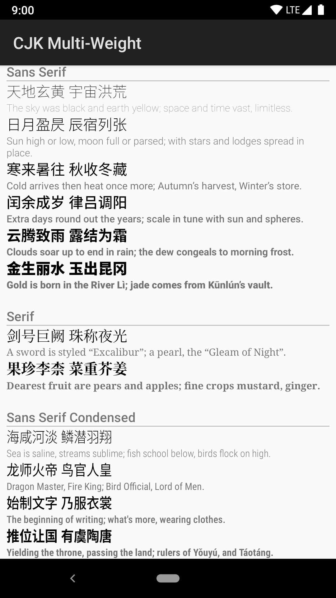
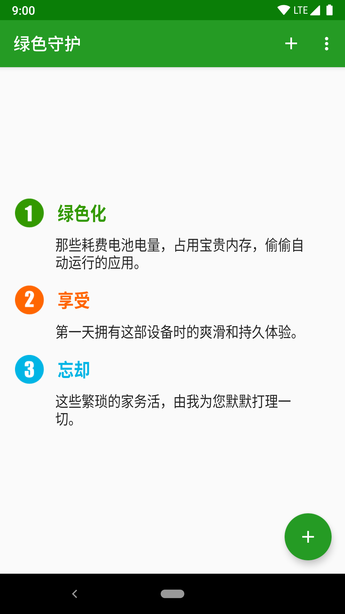

# Noto SC: Android P 简体中文字体补丁

Noto SC 是一个 [Magisk](https://forum.xda-developers.com/apps/magisk/official-magisk-v7-universal-systemless-t3473445) 模块，旨在为 Android 9 “Pie” 简体中文用户补全缺失的字体样式，让简体中文用户也能体验到 Material Design 中的丰富的字体样式变化。

Noto SC 补丁包括 3 个字族的 10 种字体样式。这些字体样式加上 Android 9 “Pie” 自带的 Noto Sans CJK SC Regular 和 Noto Serif CJK SC Regular，总共 12 个字体样式，恰好匹配多种西方语言的默认字体（Roboto、Noto Serif、Roboto Condensed）的各种样式。

| Noto Sans SC | Noto Serif SC | Noto Sans SC Condensed |
| ------------ | ------------- | ---------------------- |
| Thin         |               |                        |
| Light        |               | Light                  |
|              |               | Regular                |
| Medium       |               | Medium                 |
| Bold         | Bold          | Bold                   |
| Black        |               |                        |

### 注意

Noto SC 不像 [Noto CJK (OTC Lite)](https://github.com/Magisk-Modules-Repo/Noto-CJK-OTC-Lite) 等其他字体补丁那样大而全，带有所有需要的字体样式。Noto SC 只带有 Android P 缺失的字体样式。

因此，Noto SC 需要结合系统自带的 Noto Sans CJK SC Regular 和 Noto Serif CJK SC Regular 才能达到最佳效果。如果系统的简体中文字体已经被替换（不论是直接替换文件还修改 `fonts.xml`），安装 Noto SC 之后很可能会出现视觉样式不一致的现象。

## 更新记录

### 1.004-1

第一版。

## 感谢

原始的字体文件由 [Google](https://github.com/googlei18n/noto-cjk) 提供。

[otfcc](https://github.com/caryll/otfcc) 为修改字体文件（去除 PS hint、生成 Condensed 字体）提供了方便。

感谢 [Simon Shi](https://github.com/simonsmh) 及他的 [NotoSansCJK (Nougat&Oreo)](https://github.com/Magisk-Modules-Repo/magisk-notosanscjk-nougat) 模块。

## 预览

### 字体样式预览



### 和英文版一致的 Material 体验

|  |  |  |
| ------ | ---------- | ------------ |
| 英文版 | 原生中文版 | 中文字体补丁 |


## 关于 Condensed 版本的常见问题

### Noto Sans SC 的 Condensed 版本是如何生成的？

简而言之，把所有点的 x 坐标乘 0.88（Roboto Condensed 和 Roboto 的 xAverageCharWidth 属性的比值）。

这是我用的脚本（需要 Bash、Python、otfcc）：

```bash
ratio=0.88
for weight in Light Regular Medium Bold; do
    original=NotoSansSC-$weight
    output=NotoSansSCCondensed-$weight
    otfccdump $original.otf --pretty --ignore-hints --no-bom | sed 's/ \xa9 / © /;s/Noto Sans SC/Noto Sans SC Condensed/;s/NotoSansSC/NotoSansSCCondensed/' >$original.json
    python <<EOF
import json
font = json.load(open("$original.json"))
font["OS_2"]["xAvgCharWidth"] = round(font["OS_2"]["xAvgCharWidth"] * $ratio)
for g, glyph in font["glyf"].items():
    if (not glyph or ("contours" not in glyph.keys())):
        continue
    glyph["advanceWidth"] = round(glyph["advanceWidth"] * $ratio)
    for contour in glyph["contours"]:
        for point in contour:
            point["x"] = round(point["x"] * $ratio)
json.dump(font, open("$output.json", "w"), ensure_ascii=False)
EOF
    otfccbuild $output.json --keep-average-char-width -O3 -o $output.otf
    rm $original.json $output.json
done

```

### 这个脚本的依赖太多了，我可以直接用 FontForge 生成一个自己的 Condensed 版本吗？

不能。因为 FontForge 无法正确处理 Noto Sans CJK 字体（以及思源黑体）的 CID 映射，不能正确加载字体。

如果确实需要用 FontForge 操作 Noto Sans CJK 字体，也不是没有办法：其一是修复字体文件，参见 [FontForge 的 issue](https://github.com/fontforge/fontforge/issues/1534#issuecomment-348835384)；其二是把字体转成 TrueType 曲线之后再操作。

### Noto Sans Condensed 有包含 CJK 全部四种变体的 OTC 文件吗？

这是用于 Android P CJK 字体补丁的最理想的方案，但很遗憾，现在遇到了一些技术难题（Noto Sans CJK 的字形数太多了，处理之后总是会超出 OpenType 的上限）。